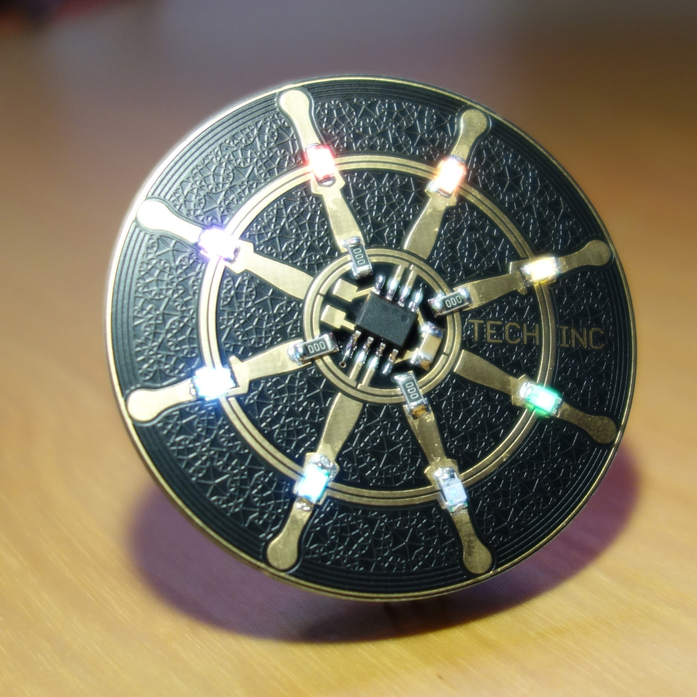

# CharliePDK #

Charlieplexed PCB making use of the Padauk PFS154 microcontroller

* 8 leds, 8 bit PWM (linear :-/)
* Wave animation when no data is sent to the chip for some time
* 9600 baud uart input (8 byte framebuffer)

